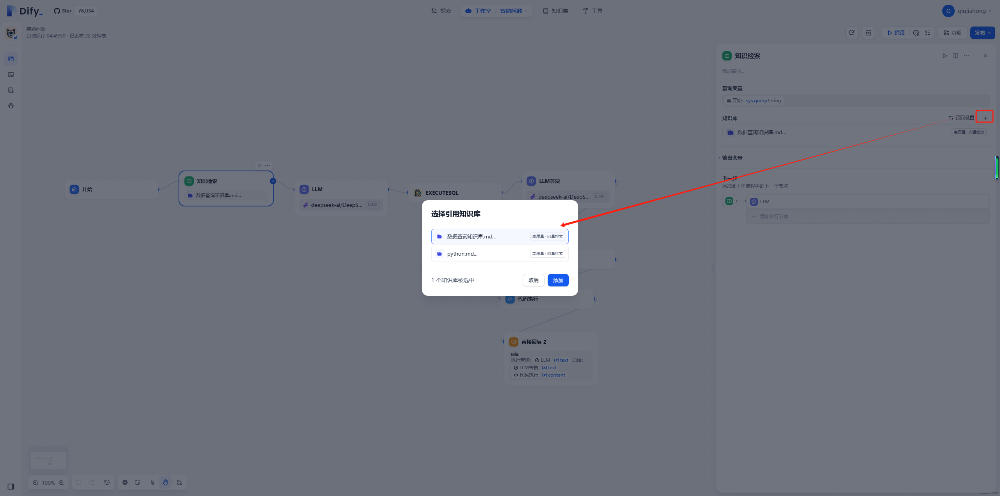
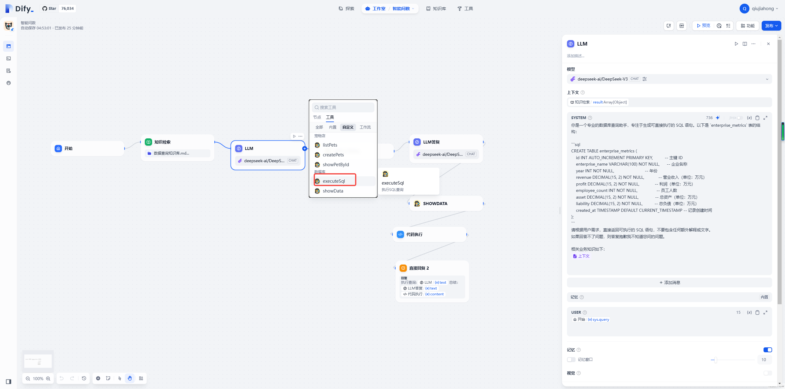
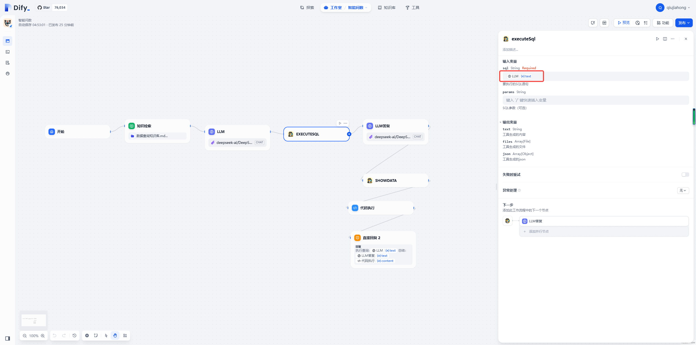
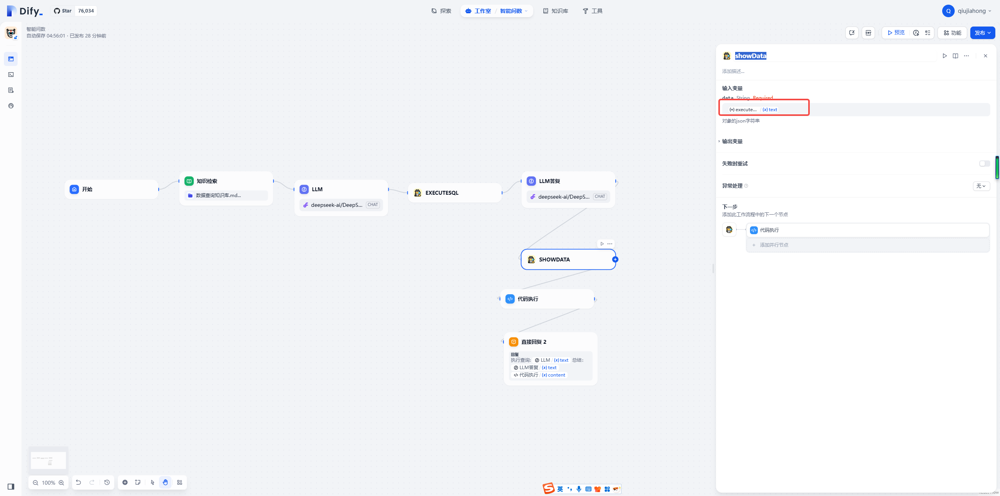
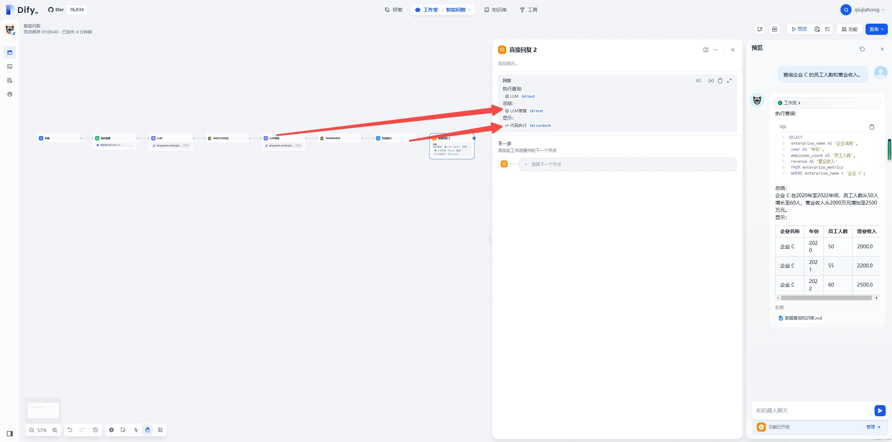
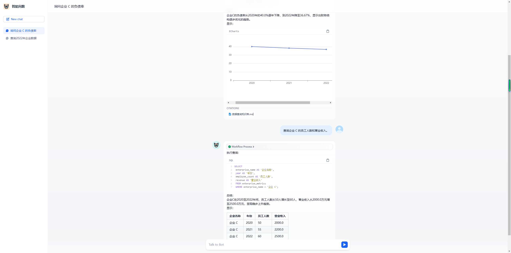

# dify读数据库动态生成echart


## 简介

本文介绍如何在dify上实现用户提问然后动态生成sql，读取渲染显示数据（表格或者）

## 准备工作

* 安装dify（docker启动）
* 配置模型
* 安装conda
* 安装pycharm 

>  如上动作不是本文重点，这里不再赘述。


## 流程说明


如图，配置步骤：
1、开始节点，默认即可
2、只是检索： 需要提前把知识库准备好
3、生成SQL，大模型配置
4、执行SQL，这里调用自定义工具查询数据库数据
5、大模型理解SQL，生成一些文字描述（这里未来是不是可以换成参数小的快的一些）
6、生成显示字符串，这里调用自定义工具生成 一些特殊字符串，可渲染表格、图
7、执行代码，解析显示字符串函数
8、回答显示。


## 操作步骤


### 准备工作

* 准备数据库，初始化如下数据。

```sql

drop TABLE if EXISTS enterprise_metrics;

CREATE TABLE enterprise_metrics (
    id INT AUTO_INCREMENT PRIMARY KEY,          -- 主键 ID
    enterprise_name VARCHAR(100) NOT NULL,      -- 企业名称
    year INT NOT NULL,                          -- 年份
    revenue DECIMAL(15, 2) NOT NULL,            -- 营业收入（单位：万元）
    profit DECIMAL(15, 2) NOT NULL,             -- 利润（单位：万元）
    employee_count INT NOT NULL,                -- 员工人数
    asset DECIMAL(15, 2) NOT NULL,              -- 总资产（单位：万元）
    liability DECIMAL(15, 2) NOT NULL,          -- 总负债（单位：万元）
    created_at TIMESTAMP DEFAULT CURRENT_TIMESTAMP -- 记录创建时间
);


INSERT INTO enterprise_metrics (enterprise_name, year, revenue, profit, employee_count, asset, liability)
VALUES
    -- 企业 A 的数据
    ('企业 A', 2020, 5000.00, 800.00, 100, 10000.00, 4000.00),
    ('企业 A', 2021, 5500.00, 850.00, 110, 11000.00, 4200.00),
    ('企业 A', 2022, 6000.00, 900.00, 120, 12000.00, 4500.00),

    -- 企业 B 的数据
    ('企业 B', 2020, 3000.00, 500.00, 80, 8000.00, 3000.00),
    ('企业 B', 2021, 3200.00, 520.00, 85, 8500.00, 3100.00),
    ('企业 B', 2022, 3500.00, 550.00, 90, 9000.00, 3200.00),

    -- 企业 C 的数据
    ('企业 C', 2020, 2000.00, 300.00, 50, 5000.00, 2000.00),
    ('企业 C', 2021, 2200.00, 320.00, 55, 5500.00, 2100.00),
    ('企业 C', 2022, 2500.00, 350.00, 60, 6000.00, 2200.00);


-- SELECT * FROM enterprise_metrics;

```

* 准备[外部tools项目](https://github.com/qiujiahong/DbTool)
  

```bash 
git clone https://github.com/qiujiahong/DbTool
cd DbTool
conda create -n dify python=3.10
conda activate dify
pip install -r requirements.txt
# 拷贝配置文件，按实际配置数据库
cp .env.example .env 
# 启动项目，启动后，可在 http://localhost:8000，访问 该服务

uvicorn main:app --reload

```


### 配置tool

* 访问dify ，工具-》自定义-》创建自定义工具
* 名称填写【数据库】，schema如下

```yaml
# Taken from https://github.com/OAI/OpenAPI-Specification/blob/main/examples/v3.0/petstore.yaml

    openapi: "3.0.0"
    info:
      version: 1.0.0
      title: 数据库
      license:
        name: MIT
    servers:
      # 这里地址按实际填写。
      # - url: http://127.0.0.1:8000
      - url: http://host.docker.internal:8000
    paths:
      /execute-sql/:
        post:
          summary: 执行SQL查询
          operationId: executeSql
          tags:
            - database
          requestBody:
            required: true
            content:
              application/json:
                schema:
                  type: object
                  required:
                    - sql
                  properties:
                    sql:
                      type: string
                      description: 要执行的SQL语句
                    params:
                      type: array
                      items:
                        type: object
                      description: SQL参数（可选）
          responses:
            '200':
              description: 查询执行成功
              content:
                application/json:
                  schema:
                    type: object
                    properties:
                      columns:
                        type: array
                        items:
                          type: string
                        description: 结果集列名
                      rows:
                        type: array
                        items:
                          type: array
                          items:
                            type: object
                        description: 查询结果数据
                      row_count:
                        type: integer
                        description: 返回的数据行数
            '500':
              description: SQL执行错误
              content:
                application/json:
                  schema:
                    $ref: "#/components/schemas/Error"
      /show-data/:
        post:
          summary: 渲染数据
          operationId: showData
          tags:
            - showdata
          requestBody:
            required: true
            content:
              application/json:
                schema:
                  type: object
                  required:
                    - data
                  properties:
                    data:
                      type: string
                      description: 对象的json字符串
          responses:
            '200':
              description: 查询执行成功
              content:
                application/json:
                  schema:
                    type: string
            '500':
              description: SQL执行错误
              content:
                application/json:
                  schema:
                    $ref: "#/components/schemas/Error"
    components:
      schemas:
        Error:
          type: object
          required:
            - code
            - message
          properties:
            code:
              type: integer
              format: int32
            message:
              type: string

# select company_name 公司名称,metric_value 指标值 from enterprise_metrics where period=2024 and metric_name="营业收入 (亿元)"

# 应答数据：  {"columns": ["公司名称", "指标值"], "rows": [["华润XXX", 135.0], ["华润怡宝", 135.0], ["华润雪花", 135.0]], "row_count": 3}
````


### 知识库准备

* 登录dify -》 知识库 -》 创建知识库 -》 [选择mkdown 文件](https://github.com/qiujiahong/DbTool/blob/main/mysql/%E6%95%B0%E6%8D%AE%E6%9F%A5%E8%AF%A2%E7%9F%A5%E8%AF%86%E5%BA%93.md)
* 下一步，分段标识使用  ``---``,其他默认，保存


### 应用配置

* 登录dify -》 工作室 -》 创建空白应用
* 选择Chatflow
* 应用名称  填写 问数据，图标默认
* 开始节点：默认即可
* 开始节点后点加号，添加【知识检索】，添加配置前面配置好的数据库  


* 【知识检索】节点后点加号，添加【LLM】，提示词如下配置：

````
你是一个专业的数据库查询助手，专注于生成可直接执行的 SQL 语句。以下是 `enterprise_metrics` 表的结构：

```sql
CREATE TABLE enterprise_metrics (
    id INT AUTO_INCREMENT PRIMARY KEY,          -- 主键 ID
    enterprise_name VARCHAR(100) NOT NULL,      -- 企业名称
    year INT NOT NULL,                          -- 年份
    revenue DECIMAL(15, 2) NOT NULL,            -- 营业收入（单位：万元）
    profit DECIMAL(15, 2) NOT NULL,             -- 利润（单位：万元）
    employee_count INT NOT NULL,                -- 员工人数
    asset DECIMAL(15, 2) NOT NULL,              -- 总资产（单位：万元）
    liability DECIMAL(15, 2) NOT NULL,          -- 总负债（单位：万元）
    created_at TIMESTAMP DEFAULT CURRENT_TIMESTAMP -- 记录创建时间
);
```
请根据用户需求，直接返回可执行的 SQL 语句，不要包含任何额外解释或文字。
如果回答不了问题，则答复抱歉我不知道您问的问题。

相关业务知识如下：
{{#context#}}

````

* 【大模型节点】后添加加号，选择工具，自定义工具，如下配置






* 【executeSql】节点后添加【LLM】重命名LLM答复，配置如下：

````
文字2句话总结一下如下数据：
{{#1740883144103.text#}}
````

> 1740883144103 是上个executeSql的返回


* 后续继续添加自定义工具【showData】,如下配置



*  后面再添加一个python代码节点，配置如下，注意输入和返回都有调整：


````python
import json

def main(data: str) -> dict:
    print("输入数据----:", data)  # 打印输入数据

    if data.startswith('"') and data.endswith('"'):
        data = data[1:-1]

    # # 第一步：解析最外层的 JSON 字符串
    outer_dict = json.loads(data)
    
    # 第二步：直接获取 content 字段的字符串值
    content_str = outer_dict["content"]
    
    # 返回最终的结果
    return {
        "result": outer_dict["chartType"],
        "content": content_str  # 直接返回字符串
    }
````


* 最后连接到回答显示配置，如下。

````
执行查询:  
{{#llm.text#}}
总结：
{{#1740884335124.text#}}
图表显示：
{{#1740903040125.content#}}
````



*  发布最后测试效果如下。


> 测试问题： 查询企业 C 的员工人数和营业收入。  查询企业 C 的负债率（负债 / 资产）。  





###  不足和待修正数据


showData节点对渲染图表格式进行了判断，目前返回三列数据，且第一例数据完全相等，且第二列数据为年费用折线图显示。其他都渲染成表格，未来这里要优化调整